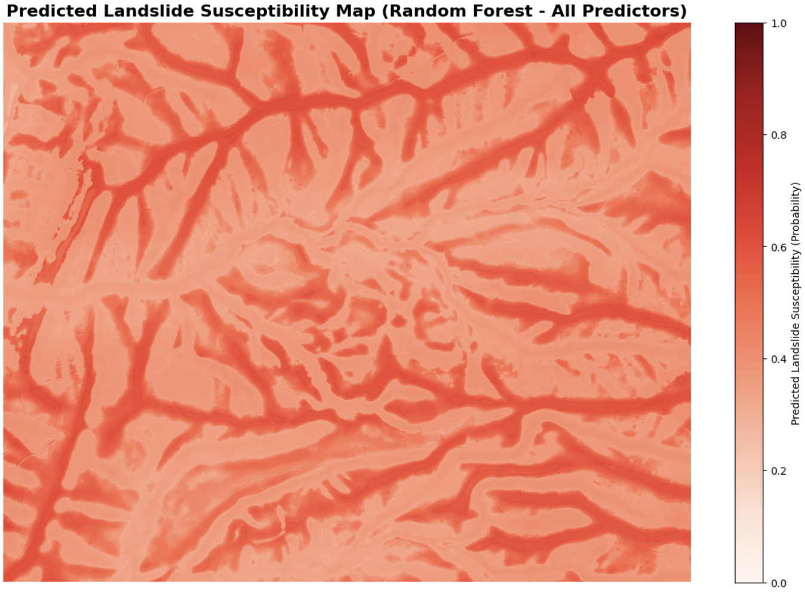

# 📍 **Landslide Susceptibility Mapping Using Random Forests**

### *Machine Learning for Spatial Prediction*

A machine-learning project that predicts **landslide susceptibility** using
a 43-band geospatial raster stack and **Random Forest classification**.
Part of USC’s *SSCI 575 — Spatial Data Science* curriculum, this project demonstrates
my ability to combine **geospatial analytics + machine learning** to build a
full end-to-end spatial prediction workflow.


## 🧰 Tech Toolbox

<p align="left">


</p>

## **Project Overview**

This project develops a **machine learning workflow** to classify areas of West Virginia into
“high” or “low” landslide susceptibility using **Random Forests**.

Main components include:

### **Data Preparation**

* Importing tabular training data (`lsm_data2.csv`)
* Creating predictor subsets (terrain-only, lithology-only, distance-only, etc.)
* Splitting data using *stratified* train-test sampling

### **Modeling**

* Training **five** Random Forest models on different predictor groups
* Generating:

  * Confusion matrices
  * Classification reports
  * ROC curves & AUC scores

### **Spatial Prediction**

* Applying the trained *All Predictors* model to a **43-band raster stack (`stack2.img`)**
* Producing a **probability-based landslide susceptibility GeoTIFF**
* Visualizing susceptibility as a continuous spatial heatmap

### **Key Outcomes**

* 🥇 *All Predictors* achieved the highest performance (AUC ≈ **0.94**)
* Terrain-only predictors also performed strongly (AUC ≈ **0.93**)
* Lithology-only was the weakest (AUC ≈ **0.66**)
* Final output includes a full-resolution susceptibility map suitable for GIS analysis


## Output



## Repository Structure

```
📁 Project3/
│── project3.ipynb        # Full workflow + analysis
│── README.md             
│── .gitignore
```

Excluded due to size:

* `stack2.img`, `.aux.xml`, `.rrd`
* Generated TIFF rasters
* Virtual environment (`.venv`)


## 👩‍💻 Author

**Chenyi Weng**
*M.S. Spatial Data Science @ USC (Class of 2025)*

🌐 [Portfolio](https://mona100421.github.io/chenyi/) •
💼 [LinkedIn](https://www.linkedin.com/in/wengchen/) •
📧 [wengchen@usc.edu](mailto:wengchen@usc.edu)
